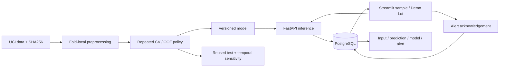
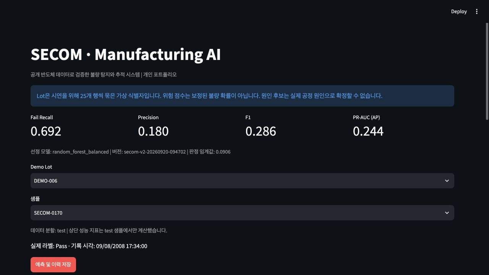
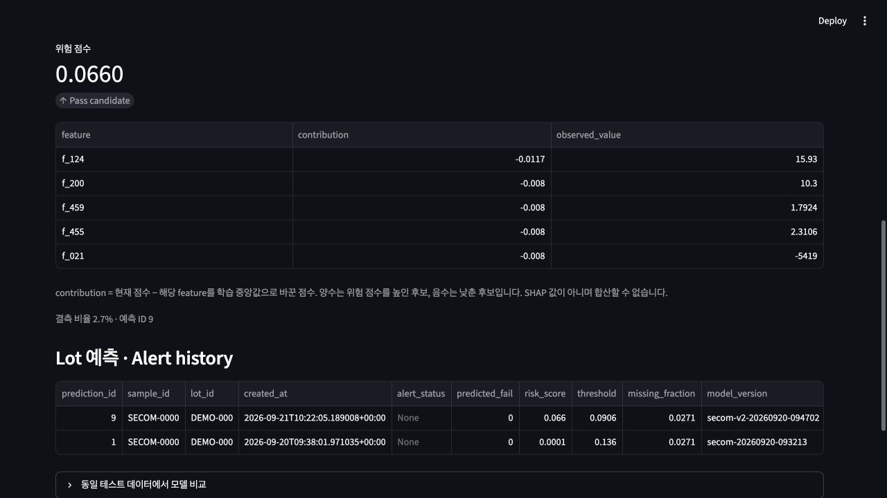

# SECOM Manufacturing AI

[](https://github.com/lukemin-dev/semiconductor-manufacturing-ai/actions/workflows/ci.yml)

**반도체 공개 데이터의 불량 탐지, 원인 후보 설명, 예측·경보 추적을 연결한 재현 가능한 시스템.**

Python · scikit-learn · XGBoost · FastAPI · PostgreSQL · Streamlit · Docker

> 공개 데이터 기반 개인 프로젝트입니다. 실제 Fab 배포, 수율 개선 또는 물리적 원인 규명을 주장하지 않습니다. 랜덤 분할 성능 개선과 시간순 평가에서 드러난 한계를 함께 공개합니다.

## 1. 무엇을 해결했나

정상 비율이 높은 제조 데이터에서는 정확도가 높아도 불량을 대부분 놓칠 수 있습니다. 데이터 품질·모델 선택·경보 부담을 함께 검토하고, 판단 당시의 입력과 모델 버전을 추적할 수 있도록 구현했습니다.

- **평가 오류 수정:** 기존 MVP의 테스트 기반 모델 선택과 IsolationForest 테스트 범위 정규화를 제거했습니다.
- **선정 절차 개선:** 단일 validation 대신 5-fold × 3회 교차검증을 사용하고 전처리·feature 선택을 각 fold 안에서 학습합니다.
- **검토 부담 명시:** OOF 경보 비율 30% 이내에서 F2를 최대화하는 시연 정책을 적용했습니다. 실제 공장 처리 용량을 뜻하지 않으며, 미래 경보 비율을 보장하지 않습니다.
- **원인 후보·이력 연결:** 샘플별 TOP5, 모델 버전, 입력·예측·경보 저장, 경보 확인 처리를 제공합니다.

## 2. 실행

Docker Engine 및 Compose가 설치된 환경에서:

```bash
git clone https://github.com/lukemin-dev/semiconductor-manufacturing-ai.git
cd semiconductor-manufacturing-ai
docker compose up --build -d
```

- Dashboard: http://localhost:8501
- OpenAPI: http://localhost:8000/docs
- 모델·DB 준비 확인: http://localhost:8000/health

이미 학습한 artifact와 공개 원자료를 포함했습니다. 첫 화면에서 Demo Lot → 샘플 → **예측 및 이력 저장**을 누르세요. 경보가 있으면 경보 ID를 선택해 확인 처리할 수 있습니다. 서비스 시작 중에는 새로고침하세요. 별도 Compose 설치 환경은 `docker-compose` 명령을 사용합니다.

```bash
# 종료; DB 볼륨은 보존
docker compose down
# 로그 확인
docker compose logs api dashboard
```

기본 계정은 로컬 데모용이며 포트는 127.0.0.1에만 연결됩니다. 외부 서비스로 공개하기 전 인증·권한·비밀 관리가 필요합니다.

## 3. 핵심 결과 - 개선과 한계를 함께

| 평가 | Recall | Precision | F1 | AP | 해석 |
|---|---:|---:|---:|---:|---|
| v1 선정 Logistic / 기존 test | 0.269 | 0.104 | 0.151 | 0.079 | 단일 검증 분할의 불안정성 |
| v2 선정 Random Forest / 같은 test | 0.692 | 0.180 | 0.286 | 0.244 | 26건 중 18건 탐지, 8건 누락, 82건 오경보 |
| v2 모델 종류 / 시간순 재학습·평가 | 0.412 | 0.062 | 0.108 | 0.082 | 17건 중 7건 탐지, 10건 누락, 106건 오경보 |

**v2의 기존 test는 v1에서 이미 확인한 데이터입니다.** 모델 선택에는 사용하지 않았지만 전후 비교를 독립된 신규 검증으로 주장할 수 없습니다. 개발 데이터도 783건에서 1,175건으로 늘었으므로 개선을 교차검증이나 알고리즘 하나의 효과로 분리할 수 없습니다.

선정 모델의 CV fold AP 평균은 0.210, 표준편차 0.080입니다. fold들이 학습 데이터를 공유하므로 이 표준편차를 독립 표본의 표준오차로 해석하지 않습니다. 기존 test의 조건부 95% bootstrap 구간은 Recall 0.500–0.846, AP 0.152–0.380입니다. 학습·모델 선택 불확실성 전체를 포함하는 구간이 아닙니다.

시간순 검증은 같은 데이터를 시간별로 재구성한 **민감도 분석**입니다. 선택한 모델 종류를 과거 60%에 새로 학습하고 중간 20%에서 임계값을 정한 후 마지막 20%를 평가했습니다. timestamp 경계의 동일 시각이 분할을 넘지 않게 했습니다. 모델 종류 선정 과정에서 이 데이터셋을 이미 살폈으므로 완전히 미사용된 외부 검증은 아닙니다. 미래 데이터 적용을 결론 내리기에는 부족합니다.

### 같은 test 392건에서 전체 비교

| Model | Recall | Precision | F1 | AP | TP / FN / FP |
|---|---:|---:|---:|---:|---|
| logistic_full_C01 | 0.577 | 0.132 | 0.214 | 0.131 | 15 / 11 / 99 |
| logistic_top40_C01 | 0.615 | 0.133 | 0.219 | 0.175 | 16 / 10 / 104 |
| logistic_top40_C001 | 0.654 | 0.144 | 0.236 | 0.174 | 17 / 9 / 101 |
| random_forest_unweighted | 0.692 | 0.165 | 0.267 | 0.201 | 18 / 8 / 91 |
| random_forest_balanced | 0.692 | 0.180 | 0.286 | 0.244 | 18 / 8 / 82 |
| xgboost_unweighted | 0.615 | 0.122 | 0.204 | 0.248 | 16 / 10 / 115 |
| xgboost_balanced | 0.654 | 0.116 | 0.197 | 0.182 | 17 / 9 / 130 |
| isolation_forest | 0.423 | 0.083 | 0.138 | 0.141 | 11 / 15 / 122 |
| always_pass | 0.000 | 0.000 | 0.000 | 0.066 | 0 / 26 / 0 |

Accuracy만 보면 전부 정상 예측도 93.4%입니다. **Recall**은 불량 누락, **Precision**은 경보 후 검사 부담, **F1**은 둘의 균형을 나타냅니다. **PR-AUC는 이 프로젝트에서 Average Precision(AP)**으로 계산하며 사다리꼴 적분과 구분합니다. Recall만 높이고 정상 대부분을 경보로 보내는 모델을 우수하다고 판단하지 않습니다.

## 4. 데이터와 실험 계약

[UCI SECOM](https://archive.ics.uci.edu/dataset/179/secom), McCann & Johnston (2008), [DOI: 10.24432/C54305](https://doi.org/10.24432/C54305), [CC BY 4.0](https://creativecommons.org/licenses/by/4.0/).

- 1,567개 샘플, Fail 104건(6.64%), 전체 결측률 4.54%, 중복 행 0건.
- 공식 설명은 591 feature이지만 실제 `secom.data` 파싱 결과는 **590개**입니다. timestamp와 라벨은 입력 feature로 사용하지 않습니다.
- 기존 test 392건을 보존하고 train+validation 1,175건을 development로 사용합니다.
- 각 CV fold의 학습 부분에서만 결측률 40% 초과 feature 및 상수 제거 → 중앙값 대체 → 표준화를 학습합니다. 최종 모델은 development에서만 다시 fit합니다.
- 정규화 강도가 다른 Logistic, fold-local ANOVA top-40, Random Forest/XGBoost 가중치 전후, 정상 데이터만 학습한 IsolationForest를 비교합니다. top-40 선택이 실제로 AP를 높이지 못한 결과도 저장했습니다.
- supervised 후보 중 **CV 평균 AP**로 선택하고, 모든 OOF 점수에서 경보 비율 제한을 만족하는 F2 최대 임계값을 정합니다. 반복 OOF는 같은 행이 3번 등장하며 독립 표본 3배로 해석하지 않습니다.
- IsolationForest도 검증 라벨로 임계값을 선택하므로 완전한 비지도 평가는 아닙니다. 점수는 음수 decision function이며 확률이나 테스트 정규화 값이 아닙니다.
- 후보·정책을 test 평가 전에 `docs/IMPROVEMENT_PLAN.md`와 코드로 정했고, 선택 결정을 `selection_decision.json`에 먼저 저장합니다. 이 파일의 순서만으로 외부 사전등록을 증명하는 것은 아닙니다.

## 5. 구조



sklearn Pipeline으로 CV·추론 전처리를 공유합니다. XGBoost가 불가능하면 HistGradientBoosting 후보로 대체합니다. FastAPI는 입력 검증과 API 경계를, PostgreSQL/SQLAlchemy는 외래키와 트랜잭션을 제공합니다. Streamlit은 검토 흐름을 빠르게 시연하며 Docker는 동일 패키지 버전을 고정합니다.

| API | 동작 |
|---|---|
| `GET /health` | 모델 버전과 실제 DB 연결 확인 |
| `GET /model` | 선정 근거, 입력 스키마, 임계값, 버전 |
| `POST /predict` | 입력 검증 → 예측/TOP5 → 입력·예측·경보 원자적 저장 |
| `GET /history?lot_id=DEMO-000` | 최근 500개 범위에서 Lot별 이벤트 조회 |
| `POST /alerts/{prediction_id}/acknowledge` | 경보 상태를 확인 완료로 변경; 반복 요청에도 같은 상태 유지 |

`process_data`, `prediction_result`, `model_version`, `alert_history` 네 테이블의 실제 DDL은 `sql/schema.sql`입니다. 같은 예측 요청은 별도 이벤트로 기록합니다. 예측 멱등키·사용자별 경보 변경 감사 로그·인증은 아직 구현하지 않았습니다. 경보 확인 상태는 실제 불량의 해결을 의미하지 않습니다.

## 6. 설명 결과를 읽는 법

하나의 feature를 학습 중앙값으로 바꾼 전후 점수 차이의 절댓값 TOP5를 반환합니다. **Local median replacement attribution**이며 SHAP이 아닙니다. 양수는 관측값이 위험 점수를 높인 후보, 음수는 낮춘 후보입니다. 기여도 합은 예측값과 일치하지 않습니다.

익명 feature와 상관관계·상호작용 때문에 물리적 원인으로 단정할 수 없어 **root-cause candidate**로만 표시합니다. global importance는 test의 절대 점수 변화량 평균으로 사후 설명에만 사용합니다. 위험 점수는 보정된 확률이 아닙니다. Demo Lot은 25개 행 ID를 묶은 가상 그룹이며 실제 공정 Lot 정보가 아닙니다.




## 7. 재현과 테스트

Python 3.12 환경에서:

```bash
python3.12 -m venv .venv
source .venv/bin/activate
pip install -r requirements.lock.txt
python scripts/download_data.py  # 원자료가 이미 있으면 생략
python scripts/improve.py --repeats 3 --max-alert-rate 0.30
python scripts/temporal_check.py
python scripts/write_report.py
pytest -q
ruff check src api dashboard scripts tests --select F
ruff format --check src api dashboard scripts tests
```

재학습은 현재 artifacts를 덮어씁니다. v1 결과는 experiments/v1에 별도 보존했습니다. 재학습 후 Docker를 다시 빌드해 서비스를 갱신합니다. `scripts/train.py`는 v1 실험 재현용이므로 현재 v2 실행에는 `scripts/improve.py`를 사용하세요. OS·BLAS 등에 따라 부동소수점 결과가 소폭 달라질 수 있습니다.

테스트는 fold 학습 범위, 분할 불교차, threshold 경보 상한과 동점, attribution 계산 일치, 잘못된 입력 거절, PostgreSQL 저장·경보 생성·확인 처리를 검사합니다. GitHub Actions는 PostgreSQL 서비스, pytest, 포맷 검사, Docker 빌드를 실행합니다. 확인된 실행 범위는 `docs/VERIFICATION.md`에 기록합니다.

## 8. 주요 증거 파일

| 위치 | 내용 |
|---|---|
| `artifacts/cv_summary.csv`, `cv_fold_metrics.csv` | 15개 fold별 AP와 평균/편차 |
| `artifacts/oof_predictions.csv`, `cv_splits.json` | development OOF 점수와 분할 감사 |
| `artifacts/feature_selection_stability.csv` | fold별 선택 feature 빈도 |
| `artifacts/metrics.json`, `confidence_intervals.json` | 같은 test 비교와 조건부 bootstrap 구간 |
| `artifacts/temporal_*` | 시간순 평가, timestamp 범위, 예측 |
| `artifacts/all_model_predictions.csv` | 모든 모델의 동일 test 예측 |
| `artifacts/local_attributions.csv`, `feature_importance.csv` | 로컬 후보 TOP5와 전역 설명 |
| `artifacts/data_manifest.json` | 출처·라이선스·원자료 SHA-256 |
| `experiments/v1` | 개선 전 결과; 삭제하거나 숨기지 않음 |

## 9. 아직 남은 한계

소수 불량, 단일 공개 데이터, 실제 Lot/장비 키 부재, 익명 feature의 측정 시점 불명확성 때문에 생산환경 일반화를 주장할 수 없습니다. 교차검증으로 개발 데이터 내부의 선택을 개선했지만 후보 탐색에 따른 낙관성을 제거하는 nested CV나 새로운 외부 데이터 검증은 수행하지 않았습니다. 시간순 성능 저하가 데이터 분포 변화 때문인지 표본 차이 때문인지도 이 실험만으로 확정하지 않습니다.

다음 우선순위는 신규 시간대 데이터 검증, 실제 공정 키 분할, 확률 보정, 현장 검사 비용/용량에 맞는 정책 검증입니다. 서비스 운영에는 인증·권한, migration 관리, 모델 승격/롤백, drift 감시, 변경 감사 로그가 더 필요합니다. 이번 결과는 자동 공정 제어가 아닌 **검토 보조 시연**입니다.

AI 코딩 도구를 활용해 구현·검증했습니다. 설계 결정, 결과와 한계를 문서화하고 코드·테스트로 재현할 수 있게 공개합니다. 데이터 재배포는 UCI CC BY 4.0 출처 표시를 따릅니다.
